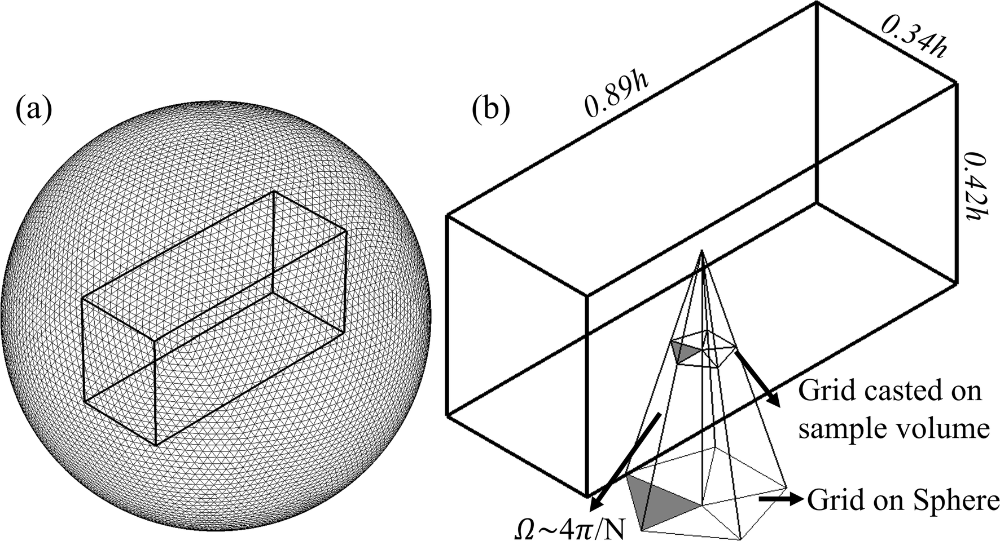
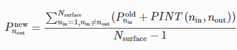
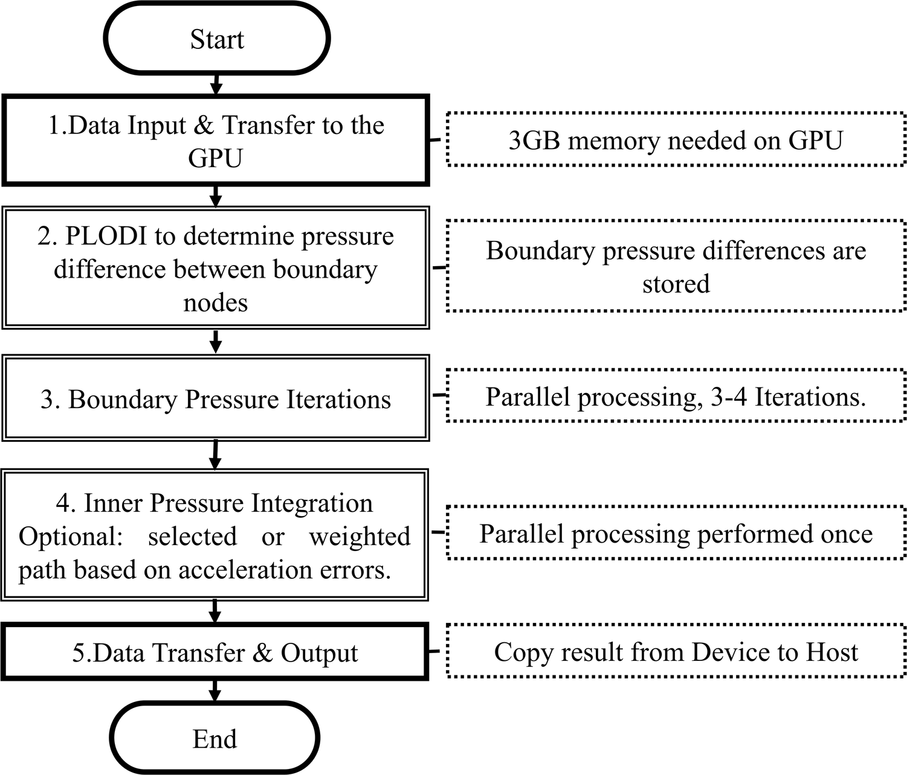
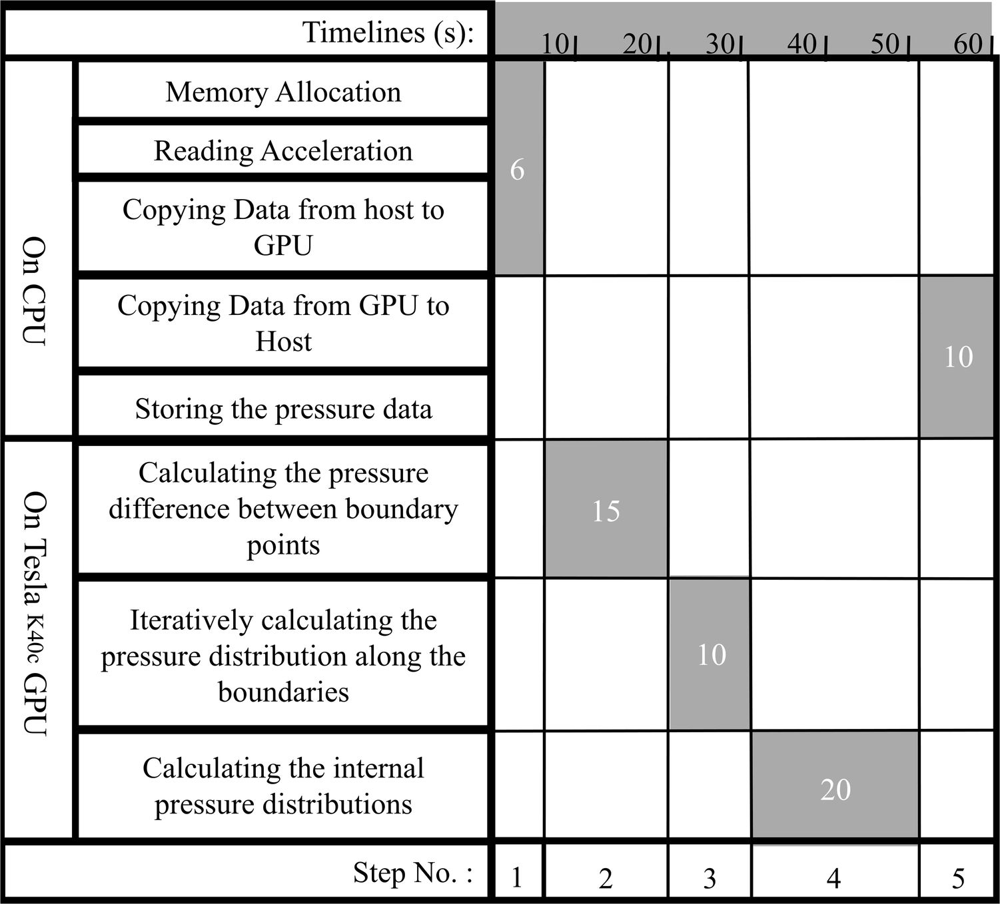

# Parallel 3D Reconstruction from Gradient

Jin Wang

# Table of Contents
1. [The integration Algorithm](README.md#The-integration-Algorithm)
2. [Flow Chart](README.md#Flow-Char)
3. [Time Line ](README.md#Time-Line)

# The integration Algorithm
Omni-directional integration is effective in minimizing the impact of local gradient errors, and provides a convenient means of avoiding areas with high gradient errors. Hence, the goal of the present effort is to develop and evaluate a fast and robust 3D pressure reconstruction method based on similar principles. The new GPU-based, parallel-line, 3D omni-directional method (Omni3D) discussed in the next section integrates the gradient along a series of parallel lines aligned in all possible directions. The pressure at every point is the average value obtained from integration along all the paths crossing this point. Hence, errors associated with a certain path are minimized. Iterations, typically 3–4, are used for correcting the initially assumed pressure distribution along the external surfaces of the sample volume. Hence, there is no need to prescribe a pressure distribution along the boundary.

# Flow Chart
(i)
Allocation of memory on the GPU device, as well as reading and transferring of the acceleration data to the GPU memory.

(ii)
Using PLODI in parallel to obtain the pressure difference between each two boundary nodes, denoted as PINT (nin, nout), where, nin and nout are the starting and ending points of an integration path.

(iii)
Calculating the pressure in each of the boundary nodes by averaging the results of integrations from all directions.

where Nsurface is the total number of grid points on the surface of the sample volume. The values of M or N could be selected independent of Nsurface. Theoretically, for large line spacing and small number of angles, some boundary points could be missed. As a rigorous error analysis later in this paper shows, such occurrence is undesirable in the application of Omni3D, and that the optimal line spacing is comparable to the grid spacing. After updating the pressure over the entire surface, this procedure is repeated until results converge. Typically, 3–4 iterations are sufficient to reach convergence.
 
(iv)
Inner pressure integration: in parallel, each GPU thread is assigned an integration path from boundary to boundary nodes, and PLODI is applied to calculate and store the pressure in inner nodes along this path. The value obtained by averaging the results obtained for all the paths is the final pressure in each internal node.

 
(v)
Transferring the data from the GPU to the host memory and storing it.

# Time Line
The timeline for applying the Omni3D method in the 100 × 47 × 38 voxel grid is shown in Fig. 3. As is evident, using a low-cost, Tesla K40c GPU board, which has 2880,745 MHz processors and 12 GB memory, reduces the total computation time to about 1 minute. The data transfer and memory allocation take 16 s; calculating the pressure difference between boundary nodes costs 15 s; parallel iterations to obtain the pressure along the boundary takes 10 s; and calculating the internal pressure costs 20 s. Furthermore, as recent tests have shown, using an advanced GPU Geforce RTX 2080 Ti board and the newer Cuda 8.0 toolkit, reduces the computation time of Omni3D by 6 times, to about 10 s. The pressure increments between boundary nodes are stored in the global memory of the GPU board to save the data transfer time. Consequently, only two applications of PLODI are needed to obtain a converged pressure field, one for the surface values, and the other for internal points. A modified approach, which would maintain the internal pressure differences between nodes during the initial application in step 2 could reduce it to one; however, it requires much larger amount of memory. The current approach is 180 times faster than pressure calculations using the above-mentioned CPU. Currently, all the computations are performed in single precision (32 bit), for which the peak floating-point performance of the present GPU is 4.29 Tflops. Using double precision, this performance decreases to 1.43 Tflops, causing an increase in computation time to about 3 min. The computation time can be further reduced by implementation of kernels concurrency as well as concurrency between memory copying and kernels when the code is used to compute a time series of the pressure field.

